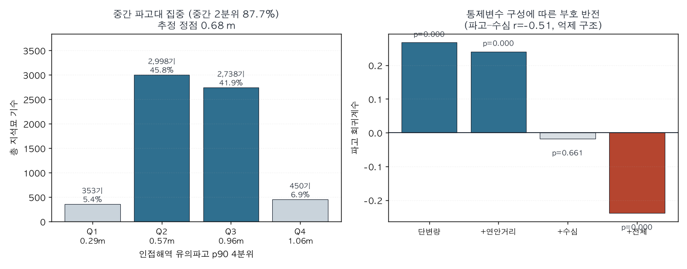
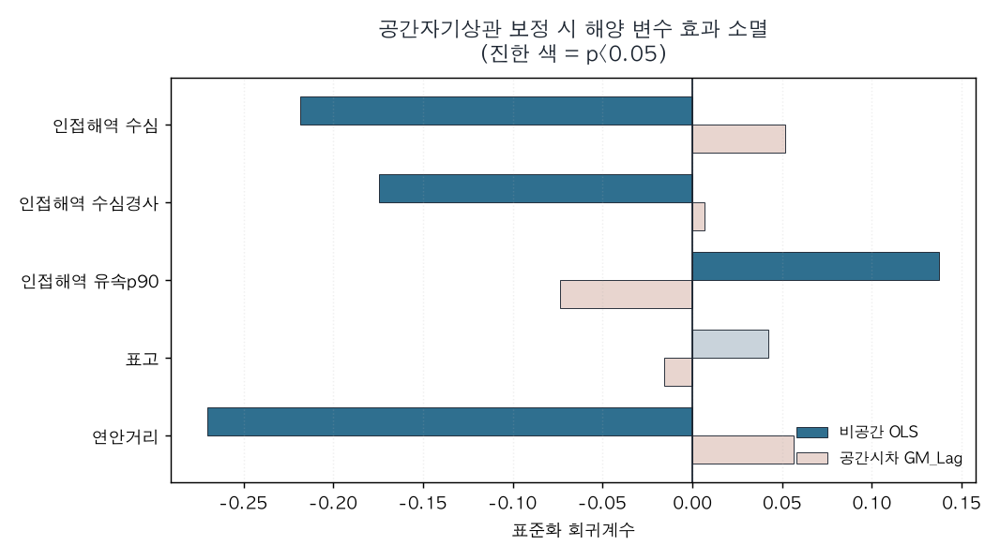

# 04. 결과 (v1 잠정)

분석일 2026-08-16 · 영산강유역 5km 격자 1,108개 · 지석묘 6,539기
**본 문서는 v1 중간 결과다.** v2에서 자료와 가설을 보강해 재검정할 예정이며,
아래 서술은 확정된 결론이 아니라 **현 자료·현 명세에서 관측된 바**로 읽어야 한다.

---

## 0. 이 문서를 읽는 법 — 오독 방지

가장 흔한 오독을 먼저 차단한다.

> ❌ **"가설이 기각되었으니 고인돌과 해양 환경은 아무 상관이 없다."**
>
> 이 독해는 **틀렸다.** 본 분석이 보여주는 것은 그것이 아니다.

정확한 진술은 세 층위로 나뉜다.

**(1) 상관관계는 존재한다. 그것도 강하게.**
파고와 지석묘 밀도 사이에는 뚜렷한 구조적 관계가 있다.
다만 그 관계가 **단조(monotonic)가 아니라 역U자**이며,
선형 모형이 이 구조를 포착하지 못했을 뿐이다.
2차항 검정 결과 `LR = 159.21, p ≈ 1.7e-36` 로, 비선형성은 압도적으로 유의하다.

**(2) 방향이 원가설과 반대인 구간이 존재한다.**
선형 명세에서 파고 계수가 음수(−0.238)로 나온 것은
"효과 없음"이 아니라 **"파고가 높은 해역에 인접할수록 지석묘가 적다"** 는
방향성 있는 발견이다. 원가설이 예측한 방향과 정반대다.
이는 정보량이 0인 결과가 아니라, 부호가 뒤집힌 정보다.

**(3) 공간보정 후 비유의 ≠ 무관계.**
공간시차 모형에서 계수가 비유의로 바뀐 것은
"해양 변수와 지석묘가 무관하다"는 증명이 아니라
**"해양 변수의 효과를 공간구조와 분리해 식별할 수 없다"** 는 뜻이다.
증거의 부재는 부재의 증거가 아니다(absence of evidence ≠ evidence of absence).

따라서 v1의 결론은 다음과 같이 한정된다.

> **원가설이 예측한 "위험할수록 고인돌이 많다"는 단조 양(+)의 관계는
> 현 자료에서 지지되지 않는다. 그러나 파고와 지석묘 분포 사이에는
> 통계적으로 매우 강한 비선형(역U자) 구조가 존재하며,
> 이는 v2에서 별도로 정식화해야 할 실질적 신호다.**

---

## 1. 자료 구조화 (Phase A)

『영산강유역 지석묘』Ⅴ 1~5권(3,175면) 정형 파싱 결과:

| 항목 | 값 |
|---|---|
| 유적 레코드 | 1,638건 |
| 기록 기수 / 현존 | 7,027기 / 5,269기 |
| 리(里) 단위 정밀 지오코딩 | 1,321건 (80.6%) |
| 입지 분류 확보 | 1,186건 (72.4%) |

시군별 상위: 나주 1,344 · 영암 1,065 · 화순 1,054 · 고창 807 · 해남 781
입지 최빈: 산록하사면 405 · 산록하평지 147 · 구릉사면 146

## 2. 위험도 지수 4성분

| 성분 | 자료 |
|---|---|
| 인접해역 유의파고 p90 | ERA5 2017–2020, 1,968시점 |
| 인접해역 표층유속 p90 | HYCOM GLBy0.08 |
| 인접해역 수심경사 | NOAA ETOPO 2022 |
| 인접해역 수심 | NOAA ETOPO 2022 |

## 3. GATE 1 — 공간 군집 (통과)

```
Moran's I = +0.2395   z = +16.84   p = 0.0010
```

---

## 4. 핵심 발견 — 파고와의 역U자 관계

### 4.1 기술통계: 중간 파고대에 87.7% 집중

| 파고 4분위 | 평균 파고 | 격자 | 총 기수 | 점유율 |
|---|---|---|---|---|
| Q1 (최저) | 0.29 m | 302 | 353 | 5.4% |
| **Q2** | **0.57 m** | 282 | **2,998** | **45.8%** |
| **Q3** | **0.96 m** | 252 | **2,738** | **41.9%** |
| Q4 (최고) | 1.06 m | 272 | 450 | 6.9% |

**양극단이 모두 비어 있다.** 가장 잔잔한 해역(5.4%)과
가장 거친 해역(6.9%)에 지석묘가 드물고, 중간대에 87.7%가 몰린다.



### 4.2 이 구조가 선형 모형을 왜곡한 방식

파고 계수는 통제변수 구성에 따라 **부호가 뒤집힌다.**

| 명세 | b(파고) | p |
|---|---|---|
| 단변량 | **+0.268** | <0.0001 |
| +연안거리 | **+0.241** | <0.0001 |
| +수심 | −0.018 | 0.661 |
| +전체 (M3) | **−0.238** | <0.0001 |

파고–수심 상관이 **r = −0.507** 로, 수심 투입 시 억제(suppression)가 발생한다.
단조 순위상관은 거의 0이다(Spearman ρ = +0.049, p = 0.10) —
역U자가 순위상관에서 상쇄되기 때문이다.

**즉 "상관 없음"처럼 보이는 수치들은 모두 단조성 가정의 산물이다.**

### 4.3 2차항 정식 검정

```
선형   logL = −2894.91   AIC = 5803.8
2차항  logL = −2815.30   AIC = 5646.6
LR = 159.21   df = 1   p = 1.68e-36
```

```
b(파고)  = −0.0878  (p = 0.054)
b(파고²) = −0.8096  (p = 3.2e-37)   ← 음의 2차항 = 역U자
추정 정점 = 0.684 m
```

유속에서도 같은 구조가 확인된다 (2차항 LR = 47.68, p < 0.0001, b = −0.140).

**원 예측과의 대조**

본 연구의 출발 예측은 "사고 해역(고파고)에 추모 무덤이 밀집한다"였다.
결과는 그 반대였다. 최고 파고 분위(1.06 m)가 6.9%에 그친다.
다만 최저 파고 분위(0.29 m)도 5.4%이므로,
"잔잔할수록 많다"는 단순 역명제도 성립하지 않는다.
자세한 추론 사슬과 해석은 [`07_discussion.md`](07_discussion.md) 참조.

**해석 가설 (v2에서 검정할 것)**
파고 0.68m 부근은 "항해가 가능하되 완전 정온하지는 않은" 해역이다.
지석묘가 이 대역에 집중된다는 것은
**실제 해상 교통이 성립한 구간**과 대응할 가능성을 시사한다.
극단적 정온 해역(내만 깊숙한 곳)과 극단적 험난 해역(외해 노출) 양쪽 모두
해상 이동의 주 경로가 아니었을 수 있다.

이는 원가설("위험할수록 많다")과도, 단순 반대가설("잔잔할수록 많다")과도 다른
**제3의 구조**이며, v1에서 가장 주목할 만한 발견이다.

주목할 점은 이 그림이 "추모"보다 **"통행"** 에 가깝다는 것이다.
고인돌의 기능 가설 중에는 **교통로 표지석설**이 이미 존재한다
(한국민족문화대백과사전). 무덤설에서 출발한 본 연구가
데이터상 다른 가설 쪽으로 밀려난 셈이며,
이는 v2에서 정면으로 다룰 만한 전환점이다.

---

## 5. 선형 명세에서의 회귀 결과

### 5.1 비공간 음이항 회귀

M2 vs M3 우도비: `LR = 282.01, df = 4, p < 0.0001`

| 변수 | b | p |
|---|---|---|
| 연안거리 | −0.647 | <0.0001 |
| 표고 | +0.062 | 0.198 |
| 인접해역 유속 p90 | +0.343 | <0.0001 |
| 인접해역 수심경사 | −0.333 | <0.0001 |
| 인접해역 수심 | −0.552 | <0.0001 |
| 인접해역 유의파고 p90 | −0.238 | <0.0001 |

M3 잔차 Moran's I = +0.0958 (p=0.0010) → 공간구조 잔존.

### 5.2 공간회귀 보정

| 변수 | OLS b (p) | GM_Lag b (p) |
|---|---|---|
| 연안거리 | −0.307 (<0.0001) | +0.056 (0.321) |
| 표고 | +0.033 (0.488) | −0.013 (0.732) |
| 인접해역 유속 p90 | +0.146 (0.0001) | −0.071 (0.062) |
| 인접해역 수심경사 | −0.200 (<0.0001) | +0.007 (0.851) |
| 인접해역 수심 | −0.293 (<0.0001) | +0.059 (0.272) |
| 인접해역 유의파고 p90 | −0.139 (0.0020) | +0.021 (0.604) |
| **공간시차 ρ** | — | **+1.184 (<0.0001)** |

```
OLS    R² = 0.094 (잔차 Moran's I = +0.367, p=0.001)
GM_Lag Pseudo R² = 0.409
```

2차항을 투입한 공간모형에서도 파고 항은 비유의였다
(b(파고)=+0.013 p=0.737, b(파고²)=−0.009 p=0.843, ρ=+1.114, Pseudo R²=0.410).

**단, 이는 §0(3)에서 밝힌 대로 "무관계"의 증명이 아니다.**
ρ=1.11~1.18이 극단적으로 크다는 것은
공간구조가 환경변수 효과를 흡수해버리는 상태를 뜻하며,
현 설계로는 두 성분을 분리 식별할 수 없다는 진단에 가깝다.
`docs/05_limitations.md` L3 참조.



---

## 6. 강건성

### MAUP 민감도

| 격자 | 유속 b (p) | 수심경사 b (p) | 파고 b (p) |
|---|---|---|---|
| 5km | +0.343 (<0.0001) | −0.333 (<0.0001) | −0.238 (<0.0001) |
| 10km | +0.430 (<0.0001) | −0.337 (<0.0001) | −0.560 (<0.0001) |
| 20km | +0.148 (0.192) | −0.526 (<0.0001) | −0.670 (<0.0001) |

유속은 20km에서 소멸. **파고는 부호가 안정적이며 척도 확대 시 오히려 강화된다.**
이 안정성은 파고 신호가 잡음이 아님을 시사한다.

### 유적 보유 격자만 (n=267)

| 변수 | b | p |
|---|---|---|
| 연안거리 | −0.245 | 0.027 |
| 인접해역 유속 p90 | +0.172 | 0.009 |
| 인접해역 유의파고 p90 | −0.066 | 0.453 |

0 과잉 제거 시 파고 선형효과는 사라진다.
즉 파고 신호는 **기수 강도**보다 **존재/부재** 층위에서 작동한다.

### 공선성

VIF 최대 1.91. 파고–수심 r=−0.507이 최대이나 VIF 1.58/1.60으로 허용 범위.
계수 붕괴는 공선성이 아니라 공간구조·비선형성 탓이다.

---

## 7. 사전 중단조건 대조

| 조건 (docs/03) | 해당 |
|---|---|
| 1. CSR 기각 실패 | 아니오 |
| 2. M2 = M3 구분 불가 | 아니오 |
| 3. 격자별 부호 뒤집힘 | **예** |

조건 3 발동으로 v1 결과는 **탐색적(exploratory)** 이다.
다만 §4의 비선형 구조는 사전 명세에 없던 **사후 발견**이므로,
v2에서 독립 자료로 재현 검정하기 전까지 확증으로 취급하지 않는다.

---

## 8. v1 잠정 결론

1. 원가설이 예측한 **단조 양(+)의 위험도–밀도 관계는 현 자료에서 지지되지 않는다.**
2. 그러나 파고와 지석묘 분포 사이에는 **매우 강한 역U자 구조**가 존재한다
   (2차항 p ≈ 1.7e-36, 중간 2분위 점유율 87.7%, 추정 정점 0.684 m).
   이는 무관계가 아니라 **원가설과 다른 형태의 관계**다.
3. 선형 명세에서의 음(−) 계수는 "효과 없음"이 아니라
   **방향이 반대인 조건부 연관**이며, 척도 확대 시 강화되어 안정적이다.
4. 공간보정 후 비유의는 **식별 실패**이지 **무관계 증명**이 아니다.
   ρ=1.18의 극단적 공간의존이 환경 신호를 흡수하고 있다.
5. 분포의 지배적 구조는 국지적 공간 확산이며,
   Schulz Paulsson(2019)의 해로 전파 모형과 정합적이다.

## 9. 부수적 관찰

- 최다 밀집 격자 3개의 연안거리: 4.8km(245기) / 17.5km(240기) / 39.2km(178기).
  연안거리와 단조 대응이 없다.
- 입지 최빈값이 산록하사면(405건)으로 해안이 아니라 산기슭이다.
- 지석묘 보유 격자의 평균 인접 파고(0.760 m)가 미보유 격자(0.683 m)보다 **높다.**
  단변량 계수가 양수인 것과 정합적이며, §4.2의 억제 구조를 뒷받침한다.

→ v2 계획: [`06_v2_roadmap.md`](06_v2_roadmap.md)
→ 연구 동기·해석·추측의 영역: [`07_discussion.md`](07_discussion.md)
